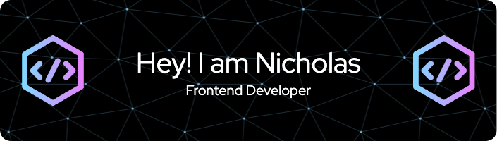

<h1 align="center">👋 Hey there! I'm Nicholas Wee</h1>
<h3>About me</h3>

I’m an undergraduate student in NTU pursuing Computer Science. Through the use of programming languages I am able to create an effective user experience. I wish to make a positive impact in peoples’ lives through technology.

  

- 🔭 I’m currently working on **my personal website**

- 🌱 I’m currently learning **Svelte**

- 💬 Ask me about **React, Redux**

- 📫 How to reach me **nicholasweecw90@gmail.com**

- ⚡ Fun fact **I enjoy playing badminton, even though I suck at it :)**

<h3 align="left">Connect with me:</h3>

<h3 align="left">Languages and Tools:</h3>

           

&nbsp;

